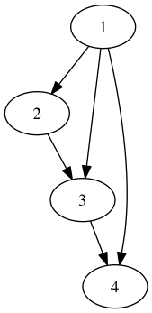

# Social Extract

## Overview

This repository contains command line tools for extracting social graphs from
social networking services, typically directed graphs of followers.

These tools use official APIs wherever prudent (you'll need to get your own API
keys) and fall back to scraping for sites that have limited APIs
(<cough>Twitter). The tools try to respect API rate limits: they will delay and
automatically retry requests when API rate limits are exceeded.

Graphs are extracted starting at a specified node and performing a
breadth-first traversal up to a specified number of hops. (Be aware that
traversal depth greater than 3 will probably take a *very long time* to run.)

## Output Formats

Graphs are constructed using numeric identifiers wherever possible. The graph
adjacency is expressed using tab-separated columns of identifiers, where users
in the left column are following users in the right column. For example, this
adjaceny list…

    1   2
    1   3
    1   4
    2   3
    3   4

…represents this graph:

Each tool also outputs a tab-separated mapping between user IDs and usernames,
for example:

    1   alice
    2   bob
    3   eve
    4   mallory

This means that the user identified by "1" is alice, "2" is bob, etc.

## Credentials

Each service requires credentials. These credentials can be supplied on the
command line, or to reduce typing they can be specified via various environment
variables. (Use the `--help` option of any tool to see what environment
variables can be used.)

A `credentials.template` file is included for defining these credential
variables. It is recommended that you copy this file, name it `credentials`,
fill it in with your own credentials, then `source credentials` before running
any extraction script.

## Instagram

The Instagram extractor uses the Instagram API, which requires you to generate
a free API key and secret.

Here is a typical workflow for Instagram. First, you need to get a numeric ID
for the seed user.

    $ python3 instagram.py id jimgaffigan
    Requesting: https://api.instagram.com/v1/users/search
             jimgaffigan 253854350
       jimgaffigan_memes 322912191
        jimgaffigancomic 375074470
         jimgaffiganpost 303150953
           __jimgaffigan 36290875

That first ID looks like the person we want. Now you can fetch a graph:

    $ python3 instagram.py graph --depth 2 253854350 users.tsv graph.tsv
    Requesting: https://api.instagram.com/v1/users/253854350
    Getting graph at depth=1
    Requesting: https://api.instagram.com/v1/users/253854350/follows
    Requesting: https://api.instagram.com/v1/users/253854350/followed-by
    Getting graph at depth=2
    Requesting: https://api.instagram.com/v1/users/8504954/follows
    Requesting: https://api.instagram.com/v1/users/8504954/followed-by
    Requesting: https://api.instagram.com/v1/users/174278920/follows
    Requesting: https://api.instagram.com/v1/users/174278920/followed-by
    ...

The output is quite long, so it has been truncated here. When it finishes, the
user mapping will be written to `users.tsv` and the directed graph will be
written to `graph.tsv`.

## Twitter

The Twitter extractor scrapes twitter.com because the Twitter API  has
draconian rate limits. Scraping requires a normal username and password, not an
API key. The Twitter extractor is based on name, not ID, so there is no need to
find a user's ID.

    $ python twitter.py --session twitter_sess graph jimgaffigan users.tsv graph.tsv
    Loading session from: twitter_sess
    Getting graph at depth=1
    Getting https://twitter.com/jimgaffigan/following
    User "jimgaffigan" has ID 6539592.
    First page min position: 1506125542656833119
    Getting https://twitter.com/jimgaffigan/following/users with max position 1506125542656833119
    Getting https://twitter.com/jimgaffigan/following/users with max position 1505350064127914724
    Getting https://twitter.com/jimgaffigan/following/users with max position 1504264513782799015
    Getting https://twitter.com/jimgaffigan/following/users with max position 1502517405897497177
    Getting https://twitter.com/jimgaffigan/following/users with max position 1499164884985496588
    Getting https://twitter.com/jimgaffigan/followers
    First page min position: 1506820731606315645
    Getting https://twitter.com/jimgaffigan/followers/users with max position 1506820731606315645
    Getting https://twitter.com/jimgaffigan/followers/users with max position 1506820260310493756
    Getting https://twitter.com/jimgaffigan/followers/users with max position 1506820025712657353
    Getting https://twitter.com/jimgaffigan/followers/users with max position 1506819679412806586
    Getting https://twitter.com/jimgaffigan/followers/users with max position 1506819406083166181
    Finished: 217 nodes

Note that Twitter authentication can be slow, so the Twitter extractor has the
option to store an authentication session to a file. If you pass the `--session
<file>` parameter, the session will be loaded from that file. (Or if the
session doesn't exist, the extractor will log in and save the session to that
file for subsequent use.)

When it finishes, the user mapping will be written to `users.tsv` and the
directed graph will be written to `graph.tsv`.
